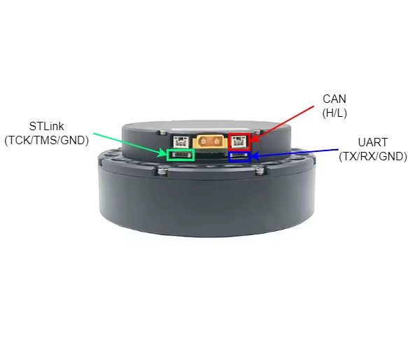
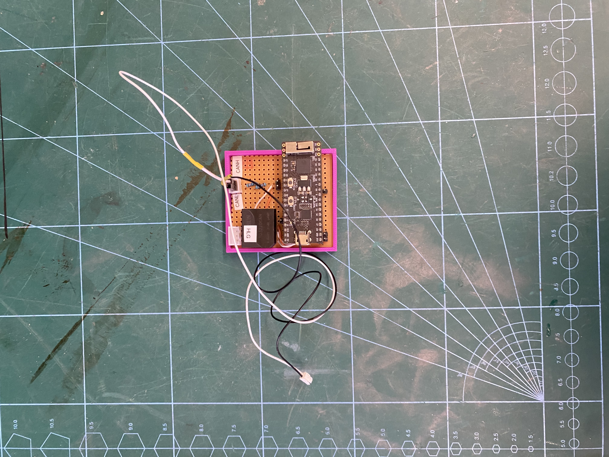
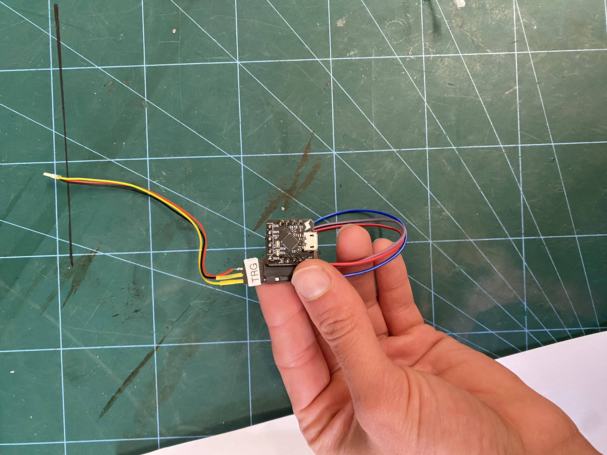
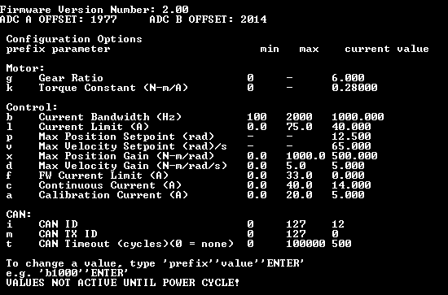
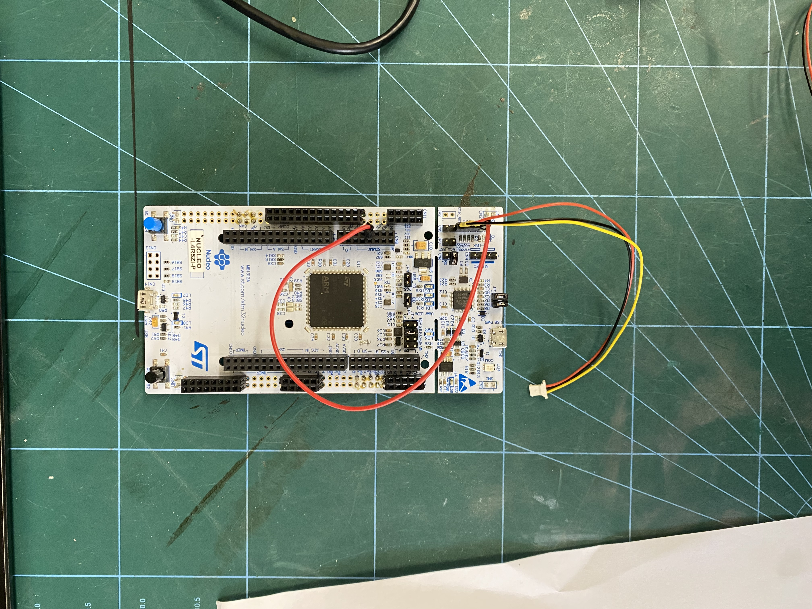

# Steadywin Motor Documentation

*Updated by Dino Claro ([clarodino@icloud.com](mailto:clarodino@icloud.com))*

## Important Links
- [Steadywin Datasheet](https://www.steadywin.cn/pd.jsp?id=17)  
- [Ben Katz Motor Driver Documentation](https://docs.google.com/document/d/1dzNVzblz6mqB3eZVEMyi2MtSngALHdgpTaDJIW_BpS4/edit?tab=t.0)  

## Inventory List
*(Updated: 07/08/2025)*

All Steadywin motors and accessories are stored in a dedicated box which can either be found in the experimental space or cold storage.

### Motors
| CAN ID | Robot        | Firmware              | Status          |  
|--------|--------------|-----------------------|-----------------|
| 10     | Shared       | V2.00 – Calibrated    |                 | 
| 11     | Shared       | V2.00 – Calibrated    |                 | 
| 12     | Baleka Spine | V2.00 – Calibrated    |                 |
| 13     | N/A          | V2.00                 | Driver Faults   | 
| 14     | Kemba        | V2.00 – Calibrated    |                 |

---

## Powering

The GIM8115-6 motors are rated for 48 V. This can be supplied by two different power supplies available in the ARU experimental spaces, depending on the application:

- For **full-scale experimentation**, the **3-phase 10 kW power supply** should be used.  
  This supply must be connected in parallel with 48 V Li-Po batteries, which absorb the back-EMF generated by the motors during experimentation. Always consult the battery monitor to pre-charge the battery, correctly configure the power supply and store the battery after.  

> [!WARNING]  
> These motors do not have a pre-charge circuit. When using the 10 kW supply, the capacitors can sink large currents on power-up. Ideally, a dedicated pre-charge circuit should be built. The current workaround is to use a bench-top supply to manually ramp a signal from 1 V to 5 V on the line labelled *“External Control”*. This gradually ramps the output of the 10 kW supply from ~10 V up to 48 V.  

- If large back-EMF is **not** expected, the **single-phase 1.2 kW power supply** may be used.  
  This supply is generally sufficient for most testing scenarios, but it will trip if excessive back-EMF is generated. It is recommended to manually ramp the voltage at start-up.  

## Operation

The GIM8115-6 has three main communication ports (shown above), used for different modes of operation. Communication is via CAN, using the MIT Motor Control protocol for sending commands and receiving motor states. Each motor has its own CAN ID and transmits its state after receiving a command.  

For details of CAN communication, consult te [Ben Katz Motor Driver documentation](https://docs.google.com/document/d/1dzNVzblz6mqB3eZVEMyi2MtSngALHdgpTaDJIW_BpS4/edit?tab=t.0) and the [BLDCMotorDrivers repo](https://github.com/BlueFifth/BLDCMotorDrivers) on the ARU GitHub.  

Currently, motors can be controlled in two ways:  

- For **full-scale experimentation**, ARU uses **Simulink Realtime** with the **Speedgoat** as the target computer. The Speedgoat manages communication between the motors and the PC and can be configured using the ARU Simulink Toolbox found on the PC in the experimental space.

- For **debugging or initial testing**, Gavin’s CAN debugging device is useful for diagnosing CAN-related issues (both hardware/wiring and firmware). The “CAN Debugger” repo (request an invitation from Gavin) should be used for flashing the device.  

---

### Serial Interface

The serial interface can be used to change user-programmable settings such as CAN parameters, motor constants, and other configuration values. The most recent firmware includes additional adjustable parameters beyond those documented in Ben Katz’s docs.  

For serial communication:  
- Connect the serial debugger device to the **UART** port.  
- Use a terminal emulator (e.g. **Tera Term**, recommended) with a baud rate of **115200**.  
- On startup, motor state data should be visible.  
- Changes are only applied after a **power cycle**.  

  
  

---

### Flashing

The ARU maintains a fork of [Ben Katz’s motorcontrol repo](https://github.com/bgkatz/motorcontrol), modified for the Steadywin GIM8115-6 motors: [BLDCMotorDrivers](https://github.com/BlueFifth/BLDCMotorDrivers).  

Flashing is performed using the **ST-Link** port (shown earlier) with **STM32CubeProgrammer**.  

